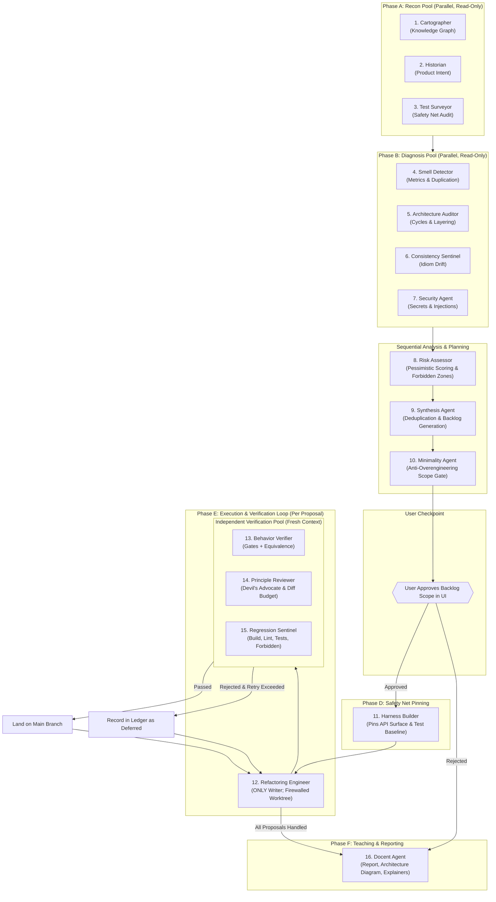

# VibeFix Architecture & Complete Agent Deep Dive

VibeFix is an automated, behavior-preserving refactoring control plane designed specifically for "vibe-coded" codebases. Unlike typical AI coding assistants that attempt to "one-shot fix" or pretty-print entire repositories in a single conversation prompt, VibeFix enforces a strict engineering invariant:

$$\text{Understand} \longrightarrow \text{Preserve} \longrightarrow \text{Improve} \longrightarrow \text{Verify} \longrightarrow \text{Explain}$$

---

## 1. System Architecture & Core Invariants

Before diving into each agent, five foundational architectural invariants govern the entire codebase:

1. **Evidence Store, Not Chat:** Agents never talk to each other in chat loops. They communicate exclusively through structured, schema-validated JSON artifacts stored on disk under `~/.vibefix/projects/<key>/runs/<runId>/artifacts/` via [evidence-store.ts](file:///d:/VibeFix/packages/core/src/store/evidence-store.ts).
2. **Single-Writer Guarantee:** Exactly **one** agent in the entire system has permission to touch code: the [Refactoring Engineer](file:///d:/VibeFix/packages/agents/src/agents/engineer.ts) (`permission: "worktree-write"`). All other 15 agents are read-only (with the exception of [Harness Builder](file:///d:/VibeFix/packages/agents/src/agents/harness-builder.ts), which writes test baselines to the evidence store).
3. **Change Firewall & Git Sandboxing:** The Engineer never touches the working repository directly. All modifications happen inside isolated `git worktree` sandboxes behind a [ChangeFirewall](file:///d:/VibeFix/packages/core/src/worktree/firewall.ts). Writes outside `filesInScope`, into lockfiles, or into `forbiddenZones` are blocked. Two firewall violations trigger an immediate auto-reject.
4. **Fresh-Context Verification Pool:** The verification agents ([Behavior Verifier](file:///d:/VibeFix/packages/agents/src/agents/verifier.ts), [Principle Reviewer](file:///d:/VibeFix/packages/agents/src/agents/principle-reviewer.ts), [Regression Sentinel](file:///d:/VibeFix/packages/agents/src/agents/regression-sentinel.ts)) are **structurally blinded** from the Engineer's reasoning ([context-builder.ts](file:///d:/VibeFix/packages/agents/src/runtime/context-builder.ts#L4-L12)). They see only the raw git diff, the original proposal, and baseline test results. An engineer cannot "talk" reviewers into accepting a buggy change.
5. **Pure Reducer State Machine:** Orchestration flow is managed by a pure reducer function in [reducer.ts](file:///d:/VibeFix/packages/core/src/orchestrator/reducer.ts) with zero I/O side effects, executed by [runtime.ts](file:///d:/VibeFix/packages/core/src/orchestrator/runtime.ts). Failing changes are retried within budget (max 1 retry), then deferred—never forced.



---

## 2. In-Depth Breakdown of Each Agent

Below is the comprehensive analysis of all **16 agents** defined in [definitions.ts](file:///d:/VibeFix/packages/agents/src/definitions.ts) and implemented in [packages/agents/src/agents/](file:///d:/VibeFix/packages/agents/src/agents/).

---

### Agent 1: Cartographer (`cartographer`)
- **File:** [cartographer.ts](file:///d:/VibeFix/packages/agents/src/agents/cartographer.ts)
- **Phase & Pool:** `recon` phase, `recon` pool (runs in parallel with Historian and Test Surveyor).
- **Capability & Permission:** `TextGeneration` | `read-only`.
- **Consumes:** None (first agent to run).
- **Produces:** `knowledge-graph` artifact.

#### Main Aim & What It Does
The Cartographer acts as the cartographic surveyor of the codebase. Its primary directive is to map facts without bias or editorial judgment: *"No opinions, just facts."* It reads the repository filesystem and import statements to build the initial structural map of the project.

#### The Heart of It
Deterministic facts extraction using [NodeFsFacts](file:///d:/VibeFix/packages/adapters/src/fs/node-fs-facts.ts) and [RegexImportGraph](file:///d:/VibeFix/packages/adapters/src/imports/regex-import-graph.ts). It constructs a graph of nodes and edges:
- **Nodes:** `repo` root, `file` (with LOC and language metadata), `module` (inferred from folder hierarchy), `endpoint` (entrypoint files), and `externalService` (detected third-party frameworks like Express, React, Prisma).
- **Edges:** Directed `imports` relations between files, and `exposes` relations between the repo and detected entrypoints.
- **Summary:** Aggregate counts of files, total LOC, languages breakdown, package manager, and build system.

#### What It Follows
Triggered upon `START`. It takes the repository snapshot, compiles the `KnowledgeGraph` object, and writes it directly to the evidence store.

#### Caveats & Pitfalls
- **Regex Import Scanning:** Uses regular expressions rather than full AST bundler resolution. If a project relies heavily on dynamic imports (`import(...)`), complex path aliases (e.g., custom `tsconfig.json` `paths` mappings that aren't straightforward), or CommonJS dynamic `require(variable)`, some dependency edges will not be resolved.
- **No Architectural Judgments:** It does not identify bad imports; it simply reports the edges that exist.

---

### Agent 2: Historian (`historian`)
- **File:** [historian.ts](file:///d:/VibeFix/packages/agents/src/agents/historian.ts)
- **Phase & Pool:** `recon` phase, `recon` pool (runs in parallel).
- **Capability & Permission:** `TextGeneration` | `read-only`.
- **Consumes:** None.
- **Produces:** `product-intent` artifact.

#### Main Aim & What It Does
The Historian is the guardian of the product's "soul." Its prime directive is to infer what the product is *supposed* to do, ensuring downstream refactoring agents never inadvertently redesign business logic, strip intended behaviors, or modify frozen areas.

#### The Heart of It
Combines deterministic multi-source discovery with LLM semantic synthesis:
1. Reads `git log` (last 50 commits) and calculates `hotPaths` (top 25 frequently changed files) via [GitTool](file:///d:/VibeFix/packages/adapters/src/git/git-tool.ts).
2. Reads `README.md`, `package.json`, `pyproject.toml`, `Cargo.toml`, or `go.mod`.
3. Scans for existing `TODO`, `FIXME`, and `HACK` debt markers.
4. Deterministically tags `coreAreas` (`src/`, `app/`, `lib/`, `services/`) and `frozenAreas` (`vendor/`, `third_party/`, `migrations/`, `generated/`, `dist/`).
5. Invokes [enrich()](file:///d:/VibeFix/packages/agents/src/runtime/text-agent-loop.ts#L10) with an LLM prompt to summarize product intent and formulate `intentConstraints`.

#### What It Follows
Runs in the `recon` pool. Produces `ProductIntent` containing `productSummary`, `coreAreas`, `frozenAreas`, `activeChurnAreas`, and `intentConstraints` (e.g., *"Preserve existing user-facing behavior unless explicitly approved"*).

#### Caveats & Pitfalls
- **Shallow Clones & Missing Docs:** If a repository is checked out with `git clone --depth 1` (common in CI) or has no README and a bare `package.json`, historical churn and intent analysis degrade to heuristic directory guessing ("Undocumented repository...").
- **Vague Commit Messages:** If commit messages are unhelpful (e.g., "fix", "wip", "update"), the model must rely purely on file paths.

---

### Agent 3: Test Surveyor (`test-surveyor`)
- **File:** [test-surveyor.ts](file:///d:/VibeFix/packages/agents/src/agents/test-surveyor.ts)
- **Phase & Pool:** `recon` phase, `recon` pool (runs in parallel).
- **Capability & Permission:** `TextGeneration` | `read-only`.
- **Consumes:** None.
- **Produces:** `test-survey` artifact.

#### Main Aim & What It Does
Audits the existing automated safety net of the repository before any refactoring begins. It checks whether the project can be built, installed, and tested, and pinpoints unmonitored code regions.

#### The Heart of It
Deterministic static detection:
- Uses [NodeTestRunner.detectCommands()](file:///d:/VibeFix/packages/adapters/src/runner/node-test-runner.ts) to detect `npm test`, `vitest`, `jest`, `pytest`, `cargo test`, `go test`, `build`, and `install` scripts.
- Detects test files matching regex patterns (`.test.ts`, `.spec.js`, `tests/`, `*_test.go`, `test_*.py`).
- Subtracts directories containing tests from source code directories to compute `untestedPaths`.
- If zero tests are found, it injects a critical alert: `"NO TESTS DETECTED — Phase C must pin current behavior before any refactoring"`.

#### What It Follows
Runs in `recon`. Produces `TestSurveyArtifact` containing `canInstall`, `canBuild`, `canTest`, `testedPaths`, and `untestedPaths`.

#### Caveats & Pitfalls
- **Static Detection Only:** Does not execute the test commands during recon (execution is deferred to Harness Builder to keep recon fast and side-effect free).
- **Non-Standard Test Files:** If a project uses custom test harnesses or scripts without standard suffixes, they may be classified as untested code paths. Coverage percentage is set to `null` initially.

---

### Agent 4: Code Smell Detector (`smell-detector`)
- **File:** [smell-detector.ts](file:///d:/VibeFix/packages/agents/src/agents/smell-detector.ts)
- **Phase & Pool:** `diagnosis` phase, `diagnosis` pool (runs in parallel).
- **Capability & Permission:** `TextGeneration` | `read-only`.
- **Consumes:** `knowledge-graph`, `test-survey`, `product-intent`.
- **Produces:** `findings` artifact.

#### Main Aim & What It Does
Detects function-level and file-level implementation smells: long/deeply nested functions, duplicate copy-paste code blocks, runaway "god files", and marked technical debt.

#### The Heart of It
Metric-driven heuristics via [computeMetrics](file:///d:/VibeFix/packages/adapters/src/metrics/file-metrics.ts):
- **Long Functions:** Identifies functions with $\ge 60$ lines (`LONG_FUNCTION_THRESHOLD`). Functions with nesting depth $\ge 5$ are tagged with high regression risk. Recommended change: `extract-function`.
- **Duplication Clusters:** Token-based scan identifying identical/similar logic across multiple files (capped at 20 clusters). Recommended change: `deduplicate`.
- **God Files:** Files exceeding LOC thresholds (top 10 longest files). Recommended change: `extract-module`.
- **Debt Markers:** Surfaces `TODO`/`FIXME` lines.
- **LLM Enrichment:** An optional LLM pass refines the explanation and impact of each finding while preserving deterministic finding IDs.

#### What It Follows
Runs in the diagnosis pool once recon completes. Produces structured `Finding` objects via [makeFinding()](file:///d:/VibeFix/packages/agents/src/shared/findings.ts#L14).

#### Caveats & Pitfalls
- **Hard Thresholds:** Fixed at 60 lines. A clean 65-line `switch` lookup table will be flagged, while a dense 58-line nested callback hell might escape detection.
- **Truncated Scope:** Top 15 functions, top 20 duplications, and top 10 god files are processed to prevent context explosion.

---

### Agent 5: Architecture Auditor (`arch-auditor`)
- **File:** [arch-auditor.ts](file:///d:/VibeFix/packages/agents/src/agents/arch-auditor.ts)
- **Phase & Pool:** `diagnosis` phase, `diagnosis` pool (runs in parallel).
- **Capability & Permission:** `TextGeneration` | `read-only`.
- **Consumes:** `knowledge-graph`, `test-survey`, `product-intent`.
- **Produces:** `findings` artifact.

#### Main Aim & What It Does
Audits system-level architectural health, dependency direction, module boundaries, and layering violations.

#### The Heart of It
Graph theory algorithms + Heuristics + LLM Principal Architect pass:
1. **Cycle Detection:** Runs a Depth-First Search (DFS) graph traversal over resolved import edges to discover circular dependency loops (capped at 10 cycles). Recommends: `introduce-boundary`.
2. **Fan-In / Fan-Out God Modules:** Identifies modules with $\ge 6$ incoming imports (change amplifiers) and $\ge 10$ outgoing imports (over-coupled modules). Recommends: `extract-module` or `introduce-boundary`.
3. **Layering Violations:** Heuristic scan checking if presentation layer files (`.tsx`, `.jsx`, `components/`) directly import persistence layers (`db/`, `database/`, `sql/`, `prisma/`, `models/`, `.sql`). Recommends: `extract-service`.
4. **LLM Principal Architect Pass:** Passes a digest of top fan-in/fan-out modules and entrypoints to an LLM simulating a principal architect to catch semantic architectural antipatterns (e.g., business logic trapped in route controllers) that regexes miss.

#### What It Follows
Runs in `diagnosis`. Outputs architectural `Finding` objects citing specific file paths and import chains.

#### Caveats & Pitfalls
- **Static Resolution Bounds:** In framework setups using Dependency Injection (like NestJS, Spring, or Inversify) or event busses, modules interact at runtime without direct static imports. The static import graph will not catch runtime architectural cycles or coupling in those paradigms.

---

### Agent 6: Consistency Sentinel (`consistency-sentinel`)
- **File:** [consistency-sentinel.ts](file:///d:/VibeFix/packages/agents/src/agents/consistency-sentinel.ts)
- **Phase & Pool:** `diagnosis` phase, `diagnosis` pool (runs in parallel).
- **Capability & Permission:** `TextGeneration` | `read-only`.
- **Consumes:** `knowledge-graph`.
- **Produces:** `findings` artifact.

#### Main Aim & What It Does
Flags convention drift and idiom fragmentation across the codebase, identifying instances where multiple conflicting solutions are used for the exact same problem.

#### The Heart of It
Deterministic regex scanning across up to 500 files for:
- **HTTP Client Drift:** Flags when 2 or more HTTP libraries coexist (e.g., `axios`, `node-fetch`, `got`, `superagent`, `undici`, `ky`, native `fetch`).
- **Error Handling Fragmentation:** Flags when $\ge 3$ incompatible error styles are used (e.g., `throw new Error()`, `res.status().send()`, `Result<T, E>`, raw `try/catch`).
- **Mixed File Naming:** Checks if $\ge 3$ naming conventions coexist (`camelCase`, `snake_case`, `kebab-case`, `PascalCase`).
- **Scattered Config:** Flags when $\ge 5$ disparate configuration/env files are scattered across directories.

#### What It Follows
Runs in `diagnosis`. Assigns `restyle-consistency`, `rename`, or `extract-module` recommendation categories.

#### Caveats & Pitfalls
- **False Inconsistency in Modern Frameworks:** In React/Next.js/TypeScript projects, having PascalCase for UI components, camelCase for custom hooks, and kebab-case for CSS/asset files is standard practice, but the $\ge 3$ threshold could trigger a naming inconsistency finding. Capped at reading 500 files.

---

### Agent 7: Security Agent (`security-agent`)
- **File:** [security-agent.ts](file:///d:/VibeFix/packages/agents/src/agents/security-agent.ts)
- **Phase & Pool:** `diagnosis` phase, `diagnosis` pool (runs in parallel).
- **Capability & Permission:** `TextGeneration` | `read-only`.
- **Consumes:** `knowledge-graph`.
- **Produces:** `findings` artifact.

#### Main Aim & What It Does
Conducts a read-only security audit for exposed credentials, injection sinks, and unsafe patterns. Crucially, it sets `recommendedChangeCategory: "none"` so that security vulnerabilities are **never blindly refactored by automated refactoring loops**.

#### The Heart of It
Deterministic regex pattern matching across up to 600 files:
- **Secrets:** AWS Access Keys (`AKIA[0-9A-Z]{16}`), RSA/EC/OpenSSH private key blocks, generic API/access tokens assigned to string literals, hardcoded passwords.
- **Unsafe Sinks:** `eval()`, shell interpolation in `child_process.exec`, unsanitized SQL string concatenation, and sensitive console logging (logging tokens or passwords).
- **Noise Control:** Skips files $> 200,000$ characters (such as lockfiles and bundled assets); caps findings at 40.

#### What It Follows
Runs in `diagnosis`. Writes findings tagged `category: "security"`. Because the category is `"none"`, downstream synthesis keeps them informational only.

#### Caveats & Pitfalls
- **Regex Limitations:** Lacks AST taint analysis or data-flow tracking. Test files using mock API keys or dummy passwords (`password = "secret"`) may trigger false positives. Complex SQL injection across helper functions will not be detected.

---

### Agent 8: Risk Assessor (`risk-assessor`)
- **File:** [risk-assessor.ts](file:///d:/VibeFix/packages/agents/src/agents/risk-assessor.ts)
- **Phase & Pool:** `riskAssessment` phase (sequential).
- **Capability & Permission:** `TypedDecision` | `read-only`.
- **Consumes:** `findings`, `test-survey`, `product-intent`.
- **Produces:** `risk-assessments` artifact.

#### Main Aim & What It Does
"The Pessimist." Its sole mandate is to evaluate how likely touching a finding is to break existing software behavior. It assigns calibrated risk scores and identifies **forbidden do-not-touch zones**.

#### The Heart of It
Blends deterministic baseline factors (40% weight) with LLM calibrated scoring (60% weight) via [decide()](file:///d:/VibeFix/packages/agents/src/runtime/decision-agent.ts#L14):
$$\text{Deterministic Baseline} = 40 + (\text{no tests} \times 20) + (\text{untested dir} \times 10) + (\text{architecture} \times 15) - (\text{dead code} \times 10) - (\text{dedupe} \times 5)$$
$$\text{Final Score} = \text{round}(0.6 \times \text{LLM Score} + 0.4 \times \text{Deterministic Score})$$

- **Risk Bands:**
  - `0 - 34`: **low**
  - `35 - 59`: **medium**
  - `60 - 84`: **high**
  - `85 - 100`: **forbidden** (do not touch!)
- **Safety Overrides:** Mechanical changes (`extract-function`, `deduplicate`, `rename`, `delete-dead-code`) that score $\ge 85$ are capped at 75 so that model pessimism does not freeze all basic cleanups when tests are absent. Any file associated with a score $\ge 85$ is added to `forbiddenZones`.

#### What It Follows
Runs sequentially after the diagnosis pool. Updates all finding risks and outputs `RiskAssessmentsArtifact` with `forbiddenZones`.

#### Caveats & Pitfalls
- **Zero-Test Repositories:** On projects with no tests, all deterministic scores start with a $+20$ penalty, meaning moderate architectural findings easily land in high or forbidden risk bands. If no LLM provider is available, it relies entirely on the fallback formula.

---

### Agent 9: Synthesis Agent (`synthesis`)
- **File:** [synthesis.ts](file:///d:/VibeFix/packages/agents/src/agents/synthesis.ts)
- **Phase & Pool:** `synthesis` phase (sequential).
- **Capability & Permission:** `TypedDecision` | `read-only`.
- **Consumes:** `findings`, `risk-assessments`, `knowledge-graph`, `test-survey`, `product-intent`.
- **Produces:** `backlog` artifact; updates `findings`.

#### Main Aim & What It Does
"Chief Diagnostician." Merges fragmented findings across all diagnosis agents, eliminates duplicates, filters out forbidden/informational items, and converts actionable findings into structured Change Proposals (RFCs) ranked by $\text{Benefit} \div \text{Risk}$.

#### The Heart of It
1. **Deduplication:** Groups findings by `${f.category}::${f.recommendedChangeCategory}::${fileOf(f)}` and retains the one with the highest evidence count.
2. **Filtering:** Moves `forbidden` risk band findings and `none` change categories into `unaddressedFindings`.
3. **Scope Formulation:** Maps change categories to glob scopes (e.g., `extract-function` $\rightarrow$ `[file]`, `introduce-boundary` $\rightarrow$ `[file, dir/**]`). Defines `filesOutOfScope: ["**/*.lock", "package.json"]`.
4. **Pedagogical Explanation:** Generates before/after narratives and Mermaid diagrams via [categoryExplanation()](file:///d:/VibeFix/packages/agents/src/shared/explain.ts#L18) and [beforeAfterMermaid()](file:///d:/VibeFix/packages/agents/src/shared/explain.ts#L80).
5. **Mode Tagging:** Classifies proposals into `minimal`, `architecture`, and `modernization` modes.
6. **Prioritization:** Uses `TypedDecision` to rank proposals from 0 to 100 based on benefit-to-risk ratio (or fallback $(100 - \text{risk})/100$).

#### What It Follows
Runs sequentially after Risk Assessor. Outputs `BacklogArtifact` containing the prioritized `proposals` array and `unaddressedFindings`.

#### Caveats & Pitfalls
- **Coarse Deduplication Key:** If a large file has two distinct long functions or two separate dead-code blocks, the deduplication key retains only one, deferring or dropping the other in the current run.

---

### Agent 10: Minimality Agent (`minimality`)
- **File:** [minimality.ts](file:///d:/VibeFix/packages/agents/src/agents/minimality.ts)
- **Phase & Pool:** `minimality` phase (sequential).
- **Capability & Permission:** `TypedDecision` | `read-only`.
- **Consumes:** `backlog`, `product-intent`.
- **Produces:** `backlog` artifact (shrunk).

#### Main Aim & What It Does
The anti-overengineering gate positioned directly before the user checkpoint. Its mandate is to shrink scope, reject scope creep, and enforce the "minimal diff" principle.

#### The Heart of It
Runs with **fresh context** (`freshContext: true`):
1. **Deterministic Scope Pruning:** If a proposal declares broad wildcards (`/**` without a directory) or more than 8 globs, trims it to the first 3 concrete globs, adds the `"no-new-abstractions"` and `"minimal-diff"` constraints, and marks it as shrunk.
2. **Mode-Based Defiance:** In `minimal` mode, automatically defers any high-risk proposal attempting to extract services or introduce boundaries.
3. **LLM Challenge:** Uses `TypedDecision` to ask: *"Should the backlog keep these proposals or defer the most ambitious one?"* If "no", it defers the single highest-risk proposal.
4. **Empty-Backlog Guard:** If pruning would eliminate all proposals, it automatically rescues the single lowest-risk proposal so the user checkpoint has something to review.

#### What It Follows
Runs right before `awaitingApproval`. Overwrites the `backlog` artifact in the evidence store.

#### Caveats & Pitfalls
- **Aggressive Pruning in Minimal Mode:** In minimal mode, large architectural moves are deferred automatically without user input. If the LLM challenge votes "no", it drops the top-risk proposal based purely on a single binary choice prompt.

---

### Agent 11: Harness Builder (`harness-builder`)
- **File:** [harness-builder.ts](file:///d:/VibeFix/packages/agents/src/agents/harness-builder.ts)
- **Phase & Pool:** `harness` phase (sequential, immediately following user approval at the checkpoint).
- **Capability & Permission:** `TextGeneration` | `evidence-write`.
- **Consumes:** `backlog`, `knowledge-graph`, `test-survey`.
- **Produces:** `characterization-plan`, `behavioral-baseline`.

#### Main Aim & What It Does
Constructs the ground-truth behavioral baseline *before* any code in the worktree is modified. If downstream modifications alter this baseline, the refactor is considered a regression and rejected.

#### The Heart of It
Deterministic surface and execution pinning:
1. **Public API Surface Extraction:** Scans up to 400 source files using regexes for exported functions, classes, variables, types, interfaces, Python `def`/`class`, and CommonJS `module.exports`. Collects every exported symbol as `file.ts::symbolName`.
2. **Suite Baseline Execution:** Executes the project's detected test command via [runner.runCommand()](file:///d:/VibeFix/packages/adapters/src/runner/node-test-runner.ts) (with a 300,000 ms / 5 min timeout) and records whether the test suite passed or failed prior to any changes (`baselineOk`).

#### What It Follows
Triggered when the user approves the checkpoint (`CHECKPOINT_APPROVED`). Produces `CharacterizationPlan` and `BehavioralBaselineArtifact`.

#### Caveats & Pitfalls
- **Surface Regexes vs Full Type Inference:** Pinning exported symbol names detects removed or added exports, but does not detect subtle TypeScript type signature mutations (e.g. changing an argument from `string` to `number` without renaming the function). Full characterization test generation is planned for a future milestone.

---

### Agent 12: Refactoring Engineer (`engineer`)
- **File:** [engineer.ts](file:///d:/VibeFix/packages/agents/src/agents/engineer.ts)
- **Phase & Pool:** `execution` phase (sequential, invoked once per proposal attempt).
- **Capability & Permission:** `TextGeneration` | `worktree-write`.
- **Consumes:** `backlog`, `characterization-plan`, `behavioral-baseline`, `knowledge-graph`, `product-intent`.
- **Produces:** `change-attempt` artifact; writes files to the worktree.

#### Main Aim & What It Does
**THE ONLY WRITER IN THE ENTIRE SYSTEM.** It receives exactly one approved proposal at a time, enters an isolated git worktree sandbox, and implements the change.

#### The Heart of It
1. **Firewalled File Access:** All file writes pass through `firewall.canWrite(path)`. If a write touches lockfiles, forbidden zones, or out-of-scope files, a violation is recorded. Two violations trigger an auto-reject.
2. **Zero-Mock Policy:** If no real LLM is routed, the Engineer **refuses to touch code** with a strict refusal message: *"VibeFix refuses to make placeholder modifications. Route a real model in Settings and retry."*
3. **Refactoring Rules System Prompt:**
   - Move, extract, rename, delete dead code—**never rewrite business logic**.
   - Preserves all public interfaces, exported names, routes, and response shapes.
   - When extracting: the extracted function retains the original code verbatim; the calling site delegates to it.
   - Smallest possible diff; touch only paths in `filesInScope`.
4. **Two-Round Repair Schema:** Validates the LLM output against `{ rationale: string, edits: [{ path: string, newContent: string }] }`. If invalid JSON or schema validation fails, it provides the error to the model for a second repair attempt.

#### What It Follows
Executes under `ExecuteProposal`. If successful, commits the changes to the worktree and dispatches to the Verification Pool.

#### Caveats & Pitfalls
- **Full File Replacement:** The model outputs full `newContent` for modified files rather than a unified diff patch. For large files ($>1,000$ lines), rewriting the entire file can consume substantial tokens and risks accidental omission of unrelated methods if the model context or generation limit is reached. Files in scope are capped at 25 files.

---

### Agent 13: Behavior Equivalence Verifier (`verifier`)
- **File:** [verifier.ts](file:///d:/VibeFix/packages/agents/src/agents/verifier.ts)
- **Phase & Pool:** `verification` pool (Gate Order: 1).
- **Capability & Permission:** `TypedDecision` | `read-only`.
- **Consumes:** `behavioral-baseline`, `backlog`.
- **Produces:** `verdict` artifact.

#### Main Aim & What It Does
The primary gatekeeper in the verification pool. Operates with fresh context (never sees the Engineer's reasoning) to verify that observable behavior and contracts remain intact.

#### The Heart of It
Deterministic code gates executed before any LLM adjudication:
1. **Gate `firewall-scope`:** Compares `git.changedFiles(worktree)` against `proposal.filesInScope`. Any out-of-scope change $\rightarrow$ `FAIL`.
2. **Gate `regression-suite`:** Re-runs the test suite in the worktree. If the baseline was green (`baselineOk === true`) and the worktree run fails $\rightarrow$ `FAIL`. (If no tests existed at baseline, marked `NOT_APPLICABLE`).
3. **Gate `public-api-surface`:** Extracts exports from changed files and compares against the pinned baseline. If any exports were added (`+`) or removed (`-`) and the proposal has `no-public-api-change` $\rightarrow$ `FAIL`.
4. **Residual Adjudication:** If and only if all deterministic gates pass, feeds the git diff (up to 12,000 characters) to `TypedDecision` asking: *"Is this diff behavior-preserving (no observable behavior change)?"* A vote of "no" vetoes the attempt.

#### What It Follows
First gate in the verification pool. Produces `VerdictArtifact`. If rejected, execution halts fail-fast.

#### Caveats & Pitfalls
- **Absence of Tests:** If the repo has no automated tests, the regression suite gate evaluates to `NOT_APPLICABLE`, relying solely on API symbol drift and the LLM diff inspection. Diffs $>12,000$ characters are truncated.

---

### Agent 14: Principle Compliance Reviewer (`principle-reviewer`)
- **File:** [principle-reviewer.ts](file:///d:/VibeFix/packages/agents/src/agents/principle-reviewer.ts)
- **Phase & Pool:** `verification` pool (Gate Order: 2).
- **Capability & Permission:** `TypedDecision` | `read-only`.
- **Consumes:** `backlog`.
- **Produces:** `verdict` artifact.

#### Main Aim & What It Does
The fresh-context "Devil's Advocate." It checks whether the diff honestly implements the requested principle without sneakily introducing unrelated redesigns or unnecessary abstractions.

#### The Heart of It
1. **Drive-by Touch Gate:** Checks that no files outside scope were touched.
2. **Diff Size Budget Gate:** If the proposal includes the `"minimal-diff"` constraint, the total number of added and removed lines in the diff **cannot exceed 400 lines**. If $> 400$ lines $\rightarrow$ automatic hard `FAIL`.
3. **LLM Devil's Advocate:** Inspects the diff (up to 10,000 chars) against the proposal's title, problem, constraints, and expected benefits. Asks: *"Does this diff comply with the stated principle and stay minimal? No scope creep, no new unnecessary abstractions?"* Can veto with a "no".

#### What It Follows
Second gate in the verification pool. Produces `VerdictArtifact`.

#### Caveats & Pitfalls
- **Strict 400-Line Diff Limit:** If an extraction or deduplication legitimately moves 250 lines of duplicate logic and updates 5 call sites, the combined added and deleted line count may exceed 400 lines, triggering a failure despite the refactoring being correct.

---

### Agent 15: Regression Sentinel (`regression-sentinel`)
- **File:** [regression-sentinel.ts](file:///d:/VibeFix/packages/agents/src/agents/regression-sentinel.ts)
- **Phase & Pool:** `verification` pool (Gate Order: 3).
- **Capability & Permission:** `TypedDecision` | `read-only`.
- **Consumes:** `behavioral-baseline`, `backlog`.
- **Produces:** `verdict` artifact.

#### Main Aim & What It Does
Runs static linters, typecheckers, and compilers inside the worktree, and acts as the final guard against forbidden zone encroachment.

#### The Heart of It
1. **Test Suite Check:** Validates that the test suite did not flip from green to red.
2. **Static Toolchain Gates:** Runs `typecheck` (`tsc --noEmit`), `lint` (`eslint`), and `build` commands detected in the repo.
   - *No-Excuse Leniency:* If a linter or typechecker fails, but there was no green baseline pin before the run started, it records `NOT_APPLICABLE` rather than blocking the refactor. Existing repository lint errors are not blamed on VibeFix.
3. **Forbidden Zone Check:** Checks `git.changedFiles(worktree)` against `forbiddenZones`. If any forbidden zone file was touched $\rightarrow$ hard `FAIL`.

#### What It Follows
Third and final gate in the verification pool. If all three verifiers pass, the change attempt is declared passed.

#### Caveats & Pitfalls
- **Pre-Existing Broken Builds:** If a repo was already failing `tsc` before VibeFix ran, typecheck errors introduced by the refactoring will not be differentiated from pre-existing typecheck errors unless the pre-existing build was completely clean. Toolchain commands have a 300-second timeout.

---

### Agent 16: Docent (`docent`)
- **File:** [docent.ts](file:///d:/VibeFix/packages/agents/src/agents/docent.ts)
- **Phase & Pool:** `report` phase (sequential, final phase).
- **Capability & Permission:** `TextGeneration` | `read-only`.
- **Consumes:** `knowledge-graph`, `test-survey`, `findings`, `backlog`, `verdict`, `product-intent`.
- **Produces:** `report` artifact and `report.md`.

#### Main Aim & What It Does
"The Teaching Layer." Produces the final, human-facing engineering report and educational summary. It explains the state of the codebase, details every change made, maps fixes to software design principles, and—crucially for developer trust—lists everything that was **deliberately NOT touched**.

#### The Heart of It
1. **Deterministic Aggregation:** Reads the run ledger from [paths.ts](file:///d:/VibeFix/packages/core/src/store/paths.ts), tallying proposals, committed changes, rejections, deferred items, and token usage.
2. **Architecture Visualizer:** Renders an ASCII/Mermaid diagram of the codebase architecture via [architectureMermaid()](file:///d:/VibeFix/packages/agents/src/shared/explain.ts#L104).
3. **Change Explainers:** For every proposal, generates:
   - What changed and why.
   - Associated principle (e.g. Single Responsibility, DRY, Boundary Separation).
   - "Today" vs "After this change".
   - Before/After Mermaid diagrams.
   - What was deliberately not touched (out-of-scope files, lockfiles, schemas).
4. **Trust Section:** Explicitly enumerates untouched components (public APIs, database migrations, lockfiles, external configs).
5. **Token-Frugal LLM Polishing:** If changes were made, passes the deterministic text to an LLM with a 1,500 token limit to polish the narrative for developer readability. Writes both a JSON `report` artifact and a standalone `report.md` file.

#### What It Follows
Executes in the `report` phase when execution finishes (or when skipped to report). Transitions the run state to `completed`.

#### Caveats & Pitfalls
- **LLM Degradation:** If the LLM polishing call times out or fails schema parsing, it falls back to the deterministic template without failing the run.

---

## 3. The Orchestration State Machine & Transformation Loop

The entire process is coordinated by the pure reducer in [reducer.ts](file:///d:/VibeFix/packages/core/src/orchestrator/reducer.ts) and executed in [runtime.ts](file:///d:/VibeFix/packages/core/src/orchestrator/runtime.ts).

### The Lifecycle Transitions

```
[init]
  │ (START)
  ▼
[recon]  ── (Pool: Cartographer, Historian, Test Surveyor in parallel)
  │ (PHASE_COMPLETED)
  ▼
[diagnosis] ── (Pool: Smell Detector, Arch Auditor, Consistency Sentinel, Security in parallel)
  │ (PHASE_COMPLETED) [If 0 findings -> SKIP_TO_REPORT]
  ▼
[riskAssessment] ── (Sequential: Risk Assessor)
  │ (PHASE_COMPLETED)
  ▼
[synthesis] ── (Sequential: Synthesis Agent) [If 0 proposals -> SKIP_TO_REPORT]
  │ (PHASE_COMPLETED)
  ▼
[minimality] ── (Sequential: Minimality Agent)
  │ (PHASE_COMPLETED)
  ▼
[awaitingApproval] ── (PAUSE: User reviews Backlog & Mermaid diagrams)
  │
  ├── (CHECKPOINT_REJECTED) ───────────► [report] (Docent explains why run aborted)
  │
  └── (CHECKPOINT_APPROVED)
        │
        ▼
      [harness] ── (Sequential: Harness Builder pins symbols & baseline)
        │ (PHASE_COMPLETED)
        ▼
      [execution] ◄─────────────────────────────────────────────┐
        │                                                       │
        ├── 1. Create fresh worktree sandbox                    │
        ├── 2. Initialize ChangeFirewall                        │
        ├── 3. Refactoring Engineer implements change           │
        │      (writes validated by firewall)                   │
        ├── 4. If empty diff or write violation -> REJECT       │
        ├── 5. Git commit in worktree                           │
        ├── 6. Verification Pool checks diff (GateOrder 1, 2, 3)│
        │      - Verifier: Scope + Baseline suite + API surface │
        │      - Principle Reviewer: Devil's advocate + <400 diff
        │      - Regression Sentinel: Build + Lint + Forbidden  │
        │                                                       │
        ├── ALL PASS?                                           │
        │   ├── YES: Cherry-pick / land on main branch          │
        │   │        Advance to next proposal ──────────────────┘
        │   └── NO:  Discard worktree sandbox
        │            Attempt < maxRetries (1)?
        │            ├── YES: Retry proposal (attempt + 1) ─────┘
        │            └── NO:  Defer proposal in ledger ─────────┘
        │
        ▼ (All proposals in queue processed)
      [report] ── (Sequential: Docent generates report.md & metrics)
        │ (PHASE_COMPLETED)
        ▼
     [completed]
```

---

## 4. Master Agent Reference Table

| # | Agent Name | ID | Phase | Capability | Permission | Fresh Context | Primary Heart / Mechanism | Critical Caveat |
|---|---|---|---|---|---|:---:|---|---|
| **1** | Cartographer | `cartographer` | `recon` | TextGeneration | `read-only` | No | Filesystem facts + Regex import graph traversal | Misses dynamic runtime imports & complex path aliases |
| **2** | Historian | `historian` | `recon` | TextGeneration | `read-only` | No | Git log churn + README + package manifests + LLM intent | Shallow git clones (`--depth 1`) impair churn analysis |
| **3** | Test Surveyor | `test-surveyor` | `recon` | TextGeneration | `read-only` | No | Test command detection + test file path matching | Static detection only; does not run tests during recon |
| **4** | Code Smell Detector | `smell-detector` | `diagnosis` | TextGeneration | `read-only` | No | AST/token metrics: long functions, duplication, god files | Fixed 60-line threshold; caps duplication at 20 clusters |
| **5** | Architecture Auditor | `arch-auditor` | `diagnosis` | TextGeneration | `read-only` | No | DFS cycle detection + Fan-in/out + UI-to-DB heuristics + LLM | Dependency Injection & event busses bypass static import graph |
| **6** | Consistency Sentinel | `consistency-sentinel` | `diagnosis` | TextGeneration | `read-only` | No | Regex scanning across 500 files for HTTP, error, naming drift | Can flag normal framework conventions (e.g. React PascalCase + hooks) |
| **7** | Security Agent | `security-agent` | `diagnosis` | TextGeneration | `read-only` | No | Regex matching for secrets, eval, shell & SQL injections | Lacks AST taint analysis; mock keys in tests can trigger findings |
| **8** | Risk Assessor | `risk-assessor` | `riskAssessment`| TypedDecision | `read-only` | No | Blends calibrated decision scoring with deterministic risk formulas | Projects with zero tests suffer an automatic $+20$ risk penalty |
| **9** | Synthesis Agent | `synthesis` | `synthesis` | TypedDecision | `read-only` | No | Deduplication + Scope generation + Impact/Risk ranking | Deduplication key retains only one finding per category/file |
| **10**| Minimality Agent | `minimality` | `minimality` | TypedDecision | `read-only` | **Yes** | Wildcard scope pruning + high-risk architectural deferrals | Automatically strips architectural changes in minimal mode |
| **11**| Harness Builder | `harness-builder` | `harness` | TextGeneration | `evidence-write`| No | Pinned public API symbols + baseline test suite execution | Pins symbol names only; does not yet generate new test files |
| **12**| Refactoring Engineer| `engineer` | `execution` | TextGeneration | `worktree-write`| No | **The only writer.** Firewalled worktree; 9 refactoring rules | Rewrites full file content; large files can consume high tokens |
| **13**| Behavior Verifier | `verifier` | `verification` | TypedDecision | `read-only` | **Yes** | Scope check + Re-run baseline suite + API export drift check | When no tests exist, relies entirely on symbols & LLM review |
| **14**| Principle Reviewer | `principle-reviewer`| `verification` | TypedDecision | `read-only` | **Yes** | Fresh-context devil's advocate + **hard 400-line diff cap** | Large multi-site refactors can exceed 400 lines and fail |
| **15**| Regression Sentinel | `regression-sentinel`| `verification` | TypedDecision | `read-only` | **Yes** | Build/lint/typecheck execution + forbidden zones check | Pre-existing broken builds pass as `NOT_APPLICABLE` |
| **16**| Docent | `docent` | `report` | TextGeneration | `read-only` | No | Pedagogical report, before/after Mermaid, "what did NOT change" | Falls back to deterministic template if LLM polishing fails |

